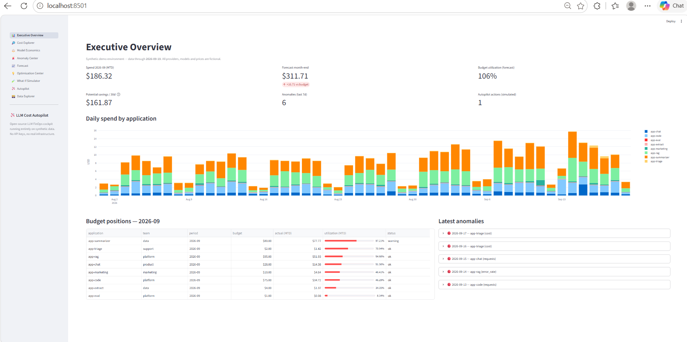

# 🛩️ LLM Cost Autopilot

**An open-source FinOps cockpit that doesn't just show your LLM spend — it
explains it, forecasts it, and proposes governed actions to cut it.**

Runs entirely on synthetic data. No API keys, no cloud, no Docker.

```bash
git clone https://github.com/bdeva1975/llm-cost-autopilot.git
cd llm-cost-autopilot
uv sync && uv run streamlit run app.py
```

That's it. First launch opens a fully populated dashboard with seeded cost
stories to investigate.



## Why this exists

Teams adopting LLMs across multiple apps, models and providers discover cost
when the invoice lands. The existing answers are raw provider billing pages
(no attribution, no intelligence) or closed SaaS observability platforms
(paid, and they need your production credentials on day one).

There is no lightweight, runnable reference for what the **full FinOps loop**
looks like:

```
OBSERVE → ANALYZE → DETECT → PREDICT → RECOMMEND → SIMULATE → GOVERN → AUTOMATE
```

This repository is that reference — small enough to read in an afternoon,
honest about every assumption, and safe to run anywhere because the entire
environment is synthetic.

## What makes it more than a dashboard

Most cost tools stop at charts. The interesting engineering here is the back
half of the loop:

1. **Explainable anomaly detection** — robust z-scores against weekday/weekend
   baselines across five metrics (cost, volume, output length, error rate,
   latency), no ML. Every flag reads like a sentence: *"app-triage spent 17.9×
   its trailing baseline on Sep 17. 96% of the increase came from atlas-ultra."*
2. **What-if simulation** — counterfactual repricing of the trailing 30 days.
   *"Move 100% of the summarizer from the frontier model to the mid-tier one"*
   → exact savings, quality shift, latency shift, context-window warnings.
3. **A governed autopilot** — ordered policy rules (configurable via YAML)
   classify every recommendation as `AUTO_APPROVE`, `REQUIRES_APPROVAL`, or
   `DO_NOT_AUTOMATE`. Auto-approved actions are re-verified through the
   simulator, humans approve or reject the rest (rejections require a reason),
   and everything lands in an append-only audit trail.
4. **Conditioned approvals** — an approval is a predicate, not a signature.
   Every approval records the conditions it was granted under (expiry, exact
   action, risk ceiling, savings floor, simulator-verified savings) and is
   revalidated against current data; failed guards mark it **STALE**, and a
   stale approval can only be re-approved together with the data that
   revalidates it. A swap approved in July never silently runs in October.

The governance part is what enterprises actually struggle with — who approves
a model swap? what's safe to automate? does the approval still hold? — and
it's the part this project demonstrates end to end.

## Honesty rules

- **Everything is synthetic.** Providers (`acme`, `borealis`, `cascade`),
  models, prices, quality scores and latencies are fictional assumptions,
  clearly labelled. Nothing represents real commercial pricing.
- **Nothing touches infrastructure.** Autopilot actions are simulated; their
  statuses say `simulated` explicitly.
- **No fake AI.** The intelligence is analytics, statistics, optimization
  arithmetic and policy evaluation. There is no LLM inside the tool.
- **Deterministic.** Same seed, same dataset, same detections, same decisions.
  The demo dataset ships with a logged ground-truth file of every injected
  anomaly (8 of them) — the detector is tested against its own answer key.

## The pages

| Page | What it answers |
|---|---|
| Executive Overview | Where is the money going, and what needs attention today? |
| Cost Explorer | Slice spend by app / model / provider / team / environment / time |
| Model Economics | Which models earn their price? (quality vs unit cost) |
| Anomaly Center | What spiked, why, and what did it cost? |
| Forecast | What will month-end look like vs budget? |
| Optimization Center | Ranked savings opportunities with risk and confidence |
| What-If Simulator | What happens if I reroute / cap this workload? |
| Autopilot | Governed decisions, conditioned approvals, revalidation, audit trail |
| Data Explorer | The synthetic dataset itself, profiles and ground truth |

## Architecture

```
generator/   synthetic traffic + scenario injection (logged ground truth)
analytics/   attribution, unit economics, budgets
anomaly/     statistical detection with plain-language causes
forecasting/ month-end projection vs budget
optimizer/   substitution, token caps, retry waste, budget exposure
simulation/  composable counterfactual repricing
autopilot/   policy engine, conditioned approvals, revalidation, audit trail
ui/          Streamlit pages (thin; all logic lives above)
config/      fictional model + application catalogs, policy.yaml
models/      Pydantic entities
tests/       135 tests, validated against injected ground truth
```

Data flows one way: `generator → parquet → engines → UI`. Engines are pure
functions over the request DataFrame; the UI only renders. Details in
[docs/architecture.md](docs/architecture.md).

## Configuring the policy

`config/policy.yaml` controls the auto-approval gate (risk ceiling, savings
floor, confidence threshold) and the approval lifetime. The category → verdict
mapping stays in code deliberately: letting YAML auto-approve output-shape
changes, code changes or budget decisions would turn a guardrail into a
footgun. See [docs/autopilot.md](docs/autopilot.md).

## Regenerating data

```bash
uv run python -m generator.demo                     # committed demo dataset
uv run python -m generator.generate --days 50       # clean base traffic
uv run python -m generator.generate --scale medium  # 10x volume
```

Scenarios: `normal`, `cost_spike`, `budget_overrun`, `multi_anomaly` — see
`generator/scenarios.py`.

## Development

```bash
uv sync
uv run pytest -q            # 135 tests
uv run ruff check .
uv run ruff format .
```

Python 3.12+. Plain pip works: `pip install -r requirements.txt`.

## Extending to real providers

The core is provider-agnostic by design: everything downstream of the parquet
file only needs the request schema in `models/entities.py`. A future
`UsageProvider` interface (OpenAI, Anthropic, Bedrock, Azure, LiteLLM, custom
gateways) plugs in at ingestion without touching the engines — see
[docs/architecture.md](docs/architecture.md#extension-points).

## Roadmap

- **v0.1** — full loop on synthetic data (shipped)
- **v0.2** — conditioned approvals with revalidation, YAML-configurable
  policy, latency-aware detection, richer scenario library (shipped)
- **v0.3** — per-workload split-routing recommendations, `UsageProvider`
  interface + first real adapter (opt-in), cost-per-business-transaction
  modelling
- **v1.0** — pluggable detectors, multi-currency, exportable reports

## Contributing

See [CONTRIBUTING.md](CONTRIBUTING.md). Ground rules: synthetic by default,
explainable always, deterministic everywhere, no fake AI.

## License

[MIT](LICENSE)

## Disclaimer

All prices, models, providers, quality scores and savings figures are
synthetic demonstrations. Validate any optimization against your own
workloads and real pricing before acting on it.