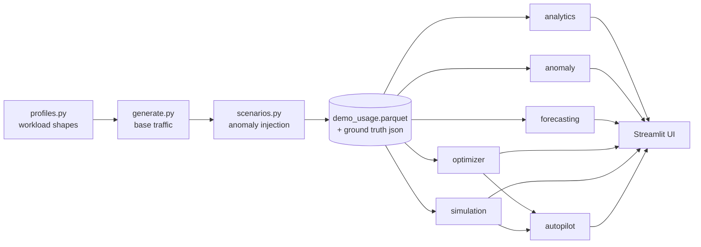

# Architecture

## Design principles

1. **One-way data flow.** `generator → parquet → engines → UI`. No engine
   writes back; the UI never computes.
2. **Pure engines.** Every intelligence module is a pure function over the
   request-level DataFrame. No global state, no I/O inside engines.
3. **Determinism.** All randomness flows through seeded `numpy` generators.
   Identical inputs produce identical datasets, detections and decisions.
4. **Ground truth as a first-class artifact.** Scenario injection logs what it
   injected (`InjectionRecord`); detection is tested against that answer key.
5. **Honest capability labels.** Simulated behaviour is named `simulated` in
   statuses, docstrings and the UI.

## Component flow

## Module responsibilities

| Module | Input | Output |
|---|---|---|
| `generator/profiles.py` | — | per-app traffic-shape constants |
| `generator/generate.py` | profiles, catalogs, seed | request DataFrame |
| `generator/scenarios.py` | DataFrame, scenario, seed | DataFrame + `InjectionRecord[]` |
| `analytics/costs.py` | DataFrame | attribution / unit-economics / budget tables |
| `anomaly/detector.py` | DataFrame | `Anomaly[]` with plain-language causes |
| `forecasting/forecast.py` | DataFrame, scope | `Forecast` (projection, band, trend) |
| `optimizer/recommend.py` | DataFrame | `Recommendation[]` with structured action params |
| `simulation/whatif.py` | DataFrame, `Action[]` | `SimulationResult` |
| `autopilot/engine.py` | DataFrame, recommendations | `AutopilotDecision[]` + `AuditEvent[]` |
| `ui/*` | all of the above | pages; `ui/data.py` owns loading + caching |

## Why no database?

At demo scale (10k–100k rows) pandas over parquet is simpler and faster to
understand than a DB layer. DuckDB becomes worthwhile at the `--scale large`
tier and is a natural v0.3 swap — the engines only depend on the DataFrame
schema, not on storage.

## Extension points

- **Real providers:** implement a `UsageProvider` that yields rows matching
  `models/entities.py::LLMRequest`; everything downstream works unchanged.
- **New detectors:** add to `anomaly/`, register injections in
  `generator/scenarios.py`, test against ground truth.
- **New optimizations:** add a category in `optimizer/recommend.py` with
  structured action params; add a policy rule in `autopilot/engine.py`.
- **New actions:** add an `Action` subtype in `simulation/whatif.py`; the
  autopilot can then verify recommendations that map to it.